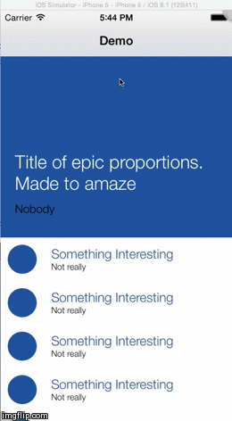

# BobPullToRefresh

BobPullToRefresh is a simple pull to refresh control for iOS.  It is designed to make it easy to implement completely custom refresh animations.  It doesn't currently have any built in refresh views, it provides a BPRRefreshView class that can be subclassed to implement a refresh control.  An example is provided in the Demo project that shows how to recreate the contol shown below.

## Usage

To run the example project, clone the repo, and open BobPullToRefresh.xcworkspace.

## Requirements

## Installation

BobPullToRefresh is available through [CocoaPods](http://cocoapods.org). To install
it, simply add the following line to your Podfile:

    pod "BobPullToRefresh"

## Author

bob, bobthekingofegypt@googlemail.com

## License

BobPullToRefresh is available under the MIT license. See the LICENSE file for more info.

